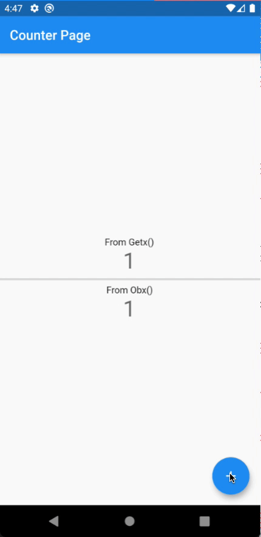
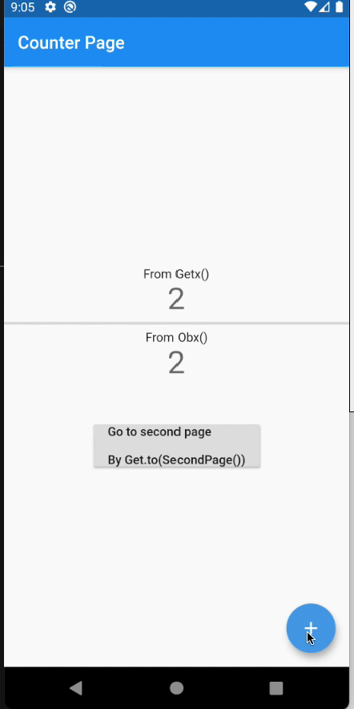

# getx_example2
Testing getx in multiple approaches

## Q has tested GET package in part of state management and navigator.
This code need to read from this [medium](https://grassrootengineer.medium.com/flutter-getx-ep-2-ecosystem-in-get-package-fe82b3c30cf6)

and in path of `/Users/atthana/Desktop/Private_Q/Flutter/getx_example2` in laptop.

---

## Show using Getx() and Obx() to get the same result.

## Show navigator by Get.to()

